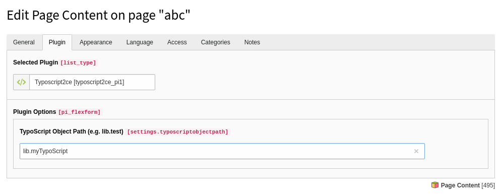

# TYPO3 Extension typoscript2ce
Render some typoscript as a content element in TYPO3


## What does it do

If you want to render some TypoScript as a Content Element, you can use this plugin.
This plugin is really a small plugin without any deeper logic, but should help you with your daily work.




## Quickstart

- Install extension `composer require in2code/typoscript2ce`
- Add some TypoScript to the current (or the root) page (e.g. lib.myTypoScript)
- Add the plugin to a page
- Call same Typoscript object (like lib.anything) into the FlexForm Field
- Done


## Example

Just define your TypoScript: 

```
lib.anything = TEXT
lib.anything.value = Show this text as content
```

And let it render by adding a new content element of type plugin typoscript2ce.


## What else

You can enable caching for the plugin in the extension manager settings, if you need it.

## Changelog

| Version    | Date       | State      | Description                                                                  |
| ---------- | ---------- | ---------- | ---------------------------------------------------------------------------- |
| 4.0.1      | 2021-03-17 | Task       | Add extension key to composer.json                                           |
| 4.0.0      | 2021-01-26 | Task       | Modernizing update (new icon, auto releases, reduced technical dept, etc...  |
| 3.0.1      | 2020-05-12 | Bugfix     | Update version in ext_emconf.php                                             |
| 3.0.0      | 2020-05-08 | Task       | Update for TYPO3 10                                                          |
| 2.0.1      | 2019-02-28 | Bugfix     | Remove outdated dependencies in ext_emconf.php                               |
| 2.0.0      | 2018-11-01 | Task       | Release for TYPO3 9.5                                                        |
| 1.2.3      | 2017-01-30 | Task       | Fix a typo in composer.json                                                  |
| 1.2.2      | 2017-01-25 | Task       | Bugfix in composer.json                                                      |
| 1.2.1      | 2017-01-25 | Task       | Same as 1.2.0 - just a mistake with TER-upload                               |
| 1.2.0      | 2017-01-25 | Task       | Move to github, add composer.json, Update dependencies for TYPO3 8.x         |
| 1.1.1      | 2016-07-13 | Bugfix     | Small bugfixes                                                               |
| 1.1.0      | 2016-01-23 | Task       | Change dependencies for TYPO3 6.0-7.x and PHP5.5                             |
| 1.0.2      | 2014-08-08 | Bugfix     | Another manual update                                                        |
| 1.0.1      | 2014-08-05 | Bugfix     | Manual update                                                                |
| 1.0.0      | 2014-07-28 | Task       | Refactored with extbase and namespaces                                       |
| 0.1.0      | 2009-03-31 | Task       | Initial release                                                              |
